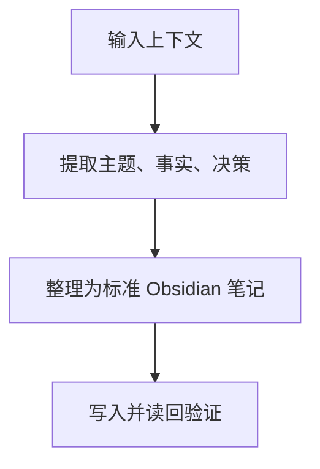

# Obsidian Note Template

Use this as the default note shape. Adjust field values to the user's context.

```markdown
---
created_by: Codex
created_at: YYYY-MM-DD
created_method: conversation-to-obsidian-note
source: conversation
project: ""
topic: ""
note_type: agent-workflow
status: captured
tags:
  - obsidian
  - agent-workflow
---

# Specific Note Title

## Key takeaway

> [!tip] Key takeaway
> One sentence explaining the most reusable conclusion from this note.
>
> One short paragraph explaining why that conclusion matters, when to apply it, and the minimum context needed to reuse it. Keep it dense; do not add filler.

## 摘要

> [!summary] 摘要
> - 优先路径：
> - 验证闭环：
> - 主要坑点：

## Context

> [!info] Context
> - 背景：
> - 目标：
> - 当前状态：
> - 适用范围：

## Key points

### 子标题 1

- 关键信息：
- 核心做法：
- 注意事项：

### 子标题 2

- 决策：
- 依据：
- 结果：

## Workflow / Method



## 后续可复用关键信息

### 环境与入口

| 项 | 值 | 用途 |
|---|---|---|
| Vault 路径 |  |  |
| API endpoint |  |  |
| MCP endpoint |  |  |
| 配置键 |  |  |

### 迁移与验证

| 检查项 | 标准 | 失败时处理 |
|---|---|---|
| 健康检查 |  |  |
| 工具列表 |  |  |
| 写入读回 |  |  |
| 已知坑点 |  |  |

## Next actions

- [ ] 

## Key references

### Obsidian notes

- 

### Local files

- 

### API endpoints

- 
```
